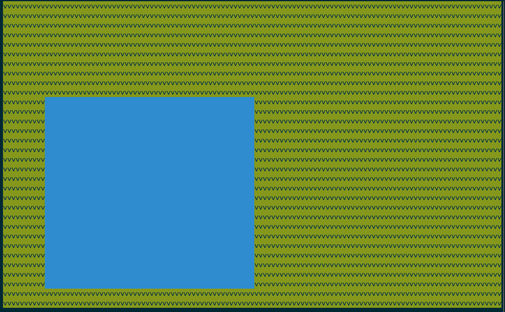
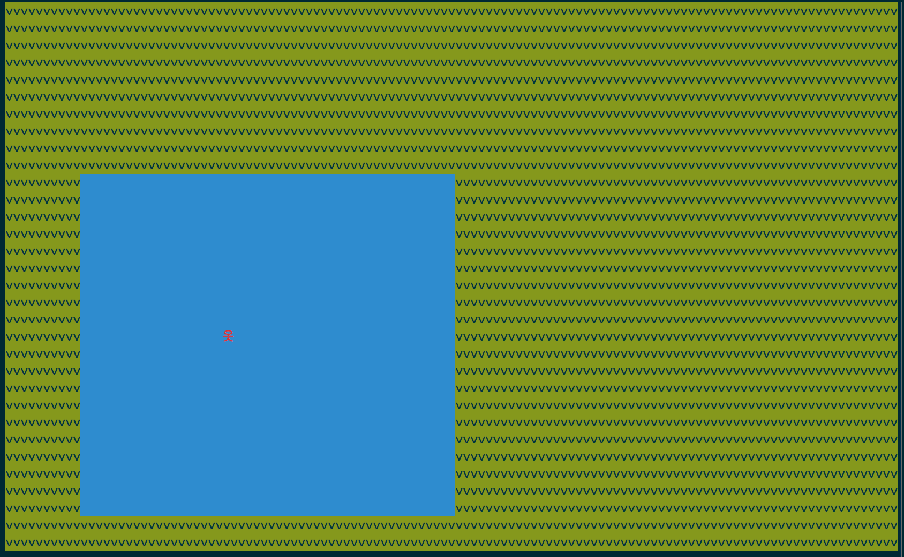

## Termloop

[](https://gitter.im/JoelOtter/termloop?utm_source=badge&utm_medium=badge&utm_campaign=pr-badge&utm_content=badge) | [GoDoc](http://godoc.org/github.com/JoelOtter/termloop)


Termloop is a pure Go game engine for the terminal, built on top of the excellent [Termbox](https://github.com/nsf/termbox-go). It provides a simple render loop for building games in the terminal, and is focused on making terminal game development as easy and as fun as possible.

Termloop is still under active development so changes may be breaking. Pull requests and issues are *very* welcome, and do feel free to ask any questions you might have on the Gitter. I hope you enjoy using Termloop; I've had a blast making it.

## Features

- Collision detection
- Render timers
- Level offsets to simulate 'camera' movement
- Debug logging
- Built-in entity types such as:
 - Framerate counters
 - Rectangles
 - Text

*To see what's on the roadmap, have a look at the [issue tracker](https://github.com/JoelOtter/termloop/issues).*

## Cool stuff built with Termloop

- [Included examples](https://github.com/JoelOtter/termloop/tree/master/_examples) (@JoelOtter)

_Feel free to add yours with a pull request!_

## Tutorial

*A proper tutorial will be added to the wiki soon - for now, check out the short introduction below, or the [included examples](https://github.com/JoelOtter/termloop/tree/master/_examples). If you get stuck during this tutorial, worry not, the full source is [here](https://github.com/JoelOtter/termloop/blob/master/_examples/tutorial.go).*

Creating a blank Termloop game is as simple as:

```go
package main

import tl "github.com/JoelOtter/termloop"

func main() {
	g := tl.NewGame()
	g.Start()
}
```

We can press the Escape key to exit. It's just a blank screen - let's make it a little more interesting.

Let's make a green background, because grass is really nice to run around on. We create a new level like so:

```go
l := tl.NewBaseLevel(tl.Cell{
	Bg: tl.ColorGreen,
	Fg: tl.ColorBlack,
	Ch: '|',
})
```

Cell is a struct that represents one cell on the terminal. We can set its background and foreground colours, and the character that is displayed. Creating a [BaseLevel](http://godoc.org/github.com/JoelOtter/termloop#BaseLevel) in this way will fill the level with this Cell.

Let's make a nice pretty lake, too. We'll use a [Rectangle](http://godoc.org/github.com/JoelOtter/termloop#Rectangle) for this. We'll put the lake at position (10, 10), with width 50 and height 10. All measurements are in terminal characters! The last argument is the colour of the Rectangle.

```go
l.AddEntity(tl.NewRectangle(10, 10, 50, 20, tl.ColorBlue))
```

Putting together what we have so far:

```go
package main

import tl "github.com/JoelOtter/termloop"

func main() {
	g := tl.NewGame()
	l := tl.NewBaseLevel(tl.Cell{
		Bg: tl.ColorGreen,
		Fg: tl.ColorBlack,
		Ch: 'v',
	})
	l.AddEntity(tl.NewRectangle(10, 10, 50, 20, tl.ColorBlue))
	g.SetLevel(l)
	g.Start()
}
```

When we run it with `go run tutorial.go`, it looks like this:



Pretty! Ish. OK, let's create a character that can walk around the environment. We're going to use object composition here - we'll create a new struct type, which contains an [Entity](http://godoc.org/github.com/JoelOtter/termloop#Entity).

To have Termloop draw our new type, we need to implement the [Drawable](http://godoc.org/github.com/JoelOtter/termloop#Drawable) interface, which means we need two methods: **Draw()** and **Tick()**. The Draw method defines how our type is drawn to the [Screen](http://godoc.org/github.com/JoelOtter/termloop#Screen) (Termloop's internal drawing surface), and the Tick method defines how we handle input.

```go
type Player struct {
	ent *tl.Entity
}

// Here, Draw simply tells the Entity ent to handle its own drawing.
// We don't need to do anything.
func (p *Player) Draw(s *tl.Screen) { p.ent.Draw(s) }

func (p *Player) Tick(ev tl.Event) {
	if ev.Type == tl.EventKey { // Is it a keyboard event?
		x, y := p.ent.Position()
		switch ev.Key { // If so, switch on the pressed key.
		case tl.KeyArrowRight:
			p.ent.SetPosition(x+1, y)
			break
		case tl.KeyArrowLeft:
			p.ent.SetPosition(x-1, y)
			break
		case tl.KeyArrowUp:
			p.ent.SetPosition(x, y-1)
			break
		case tl.KeyArrowDown:
			p.ent.SetPosition(x, y+1)
			break
		}
	}
}
```

Now that we've built our Player type, let's add one to the level. I'm going to use the character '옷', because I think it looks a bit like a stick man.

```go
p := Player{
	ent: tl.NewEntity(1, 1, 1, 1),
}
// Set the character at position (0, 0) on the entity.
p.ent.SetCell(0, 0, &tl.Cell{Fg: tl.ColorRed, Ch: '옷'})
l.AddEntity(&p)

```



Running the game again, we see that we can now move around the map using the arrow keys. Neato! However, we can stroll across the lake just as easily as the grass. Our character isn't the Messiah, ~~he's a very naughty boy,~~ so let's add some collisions.

*Collision tutorial to follow...*
