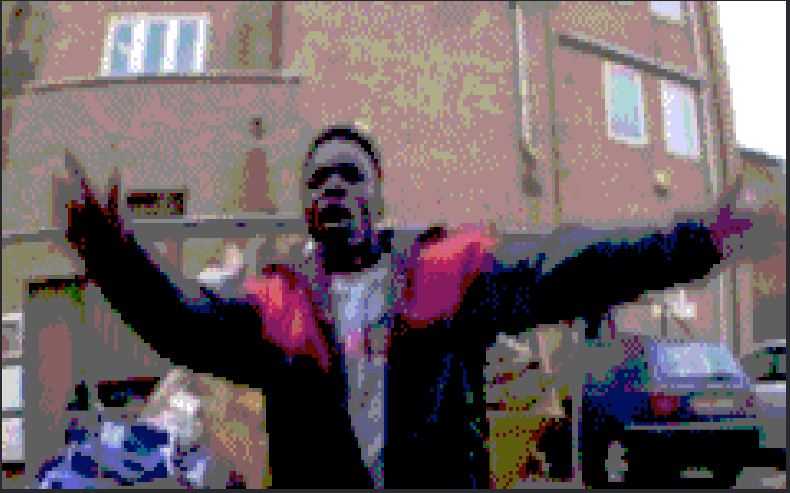

# Examples

This directory contains several small examples, which will hopefully show how to use some of Termloop's features.

## movingtext.go

This example demonstrates how to use keyboard input, as well as the Text builtin. To run, just do:

`go run movingtext.go "Some text here"`

## collision.go

This example demonstrates how to use Termloop's built in collision checking, as well as simple keyboard input. It also includes an example of an FpsText. The player's rectangle will turn blue and stop when it collides with something. To run, just do:

`go run collision.go`

## Pyramid!

You've started at the top of a pyramid - how many levels down can you get before you're helplessly lost?

This is a bit of a bigger example, showcasing Termloop's collision detection, as well as level offsets, which can be used to simulate camera movement. The mazes are all randomly generated using [Prim's algorithm](https://en.wikipedia.org/wiki/Maze_generation_algorithm#Randomized_Prim.27s_algorithm).
This example also gives a demo of how Termloop's debug logging works.

To run:

`go run pyramid.go`

## image.go

This example shows Termloop's image loading capabilities. Simply run the example with a path to an image as the first parameter, and you'll see a very simple image viewer. It can load PNG, JPEG or GIF images. Here's an example of what it looks like showing [Tempa T](http://www.youtube.com/watch?v=OZ6G7qwjom4).

